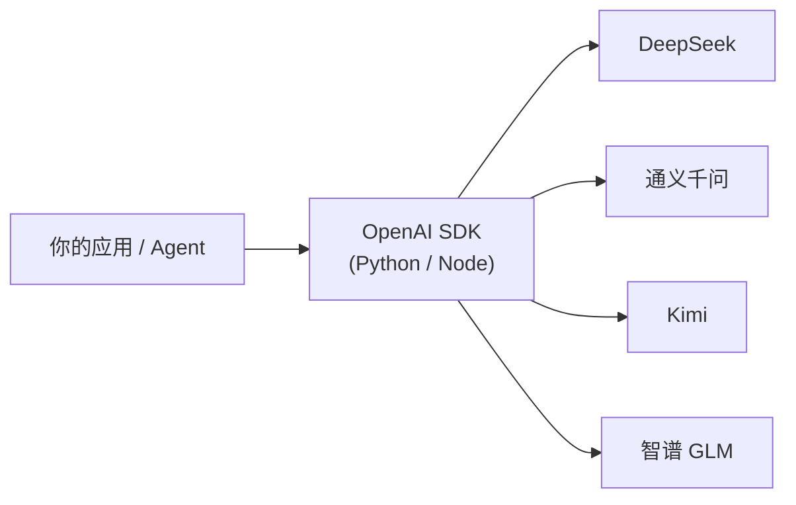
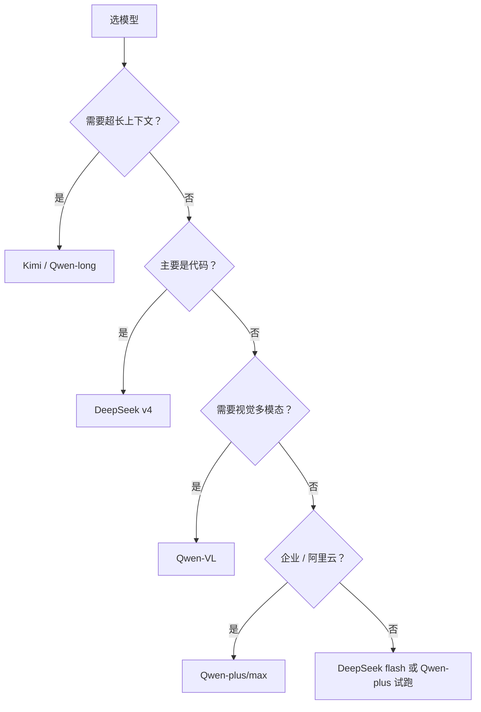

# 国产大模型接入说明 v0.1

> **TL;DR**：四家均提供 **OpenAI 兼容 Chat Completions**；改 `base_url` + `api_key` + `model` 即可复用同一套 SDK。选型看 **场景**（代码 / 长文 / 工具调用 / 成本），不看「谁最强」单点排名。

---

## 1. 统一接入模式



**通用 Python 模板**（换环境变量即可切换厂商）：

```python
import os
from openai import OpenAI

client = OpenAI(
    api_key=os.environ["LLM_API_KEY"],
    base_url=os.environ["LLM_BASE_URL"],
)

resp = client.chat.completions.create(
    model=os.environ["LLM_MODEL"],
    messages=[
        {"role": "system", "content": "你是助手。"},
        {"role": "user", "content": "你好"},
    ],
    temperature=0.4,
)
print(resp.choices[0].message.content)
```

**密钥管理**：放 `.env` 或环境变量，**勿 commit**；本仓库见 [`.env.example`](../.env.example)。

---

## 2. 四家速览对比

| 厂商 | 开放平台 | 国内 base_url（OpenAI 兼容） | 代表模型（2026，以官方为准） | 一句话定位 |
|------|----------|------------------------------|------------------------------|------------|
| **DeepSeek** | [platform.deepseek.com](https://platform.deepseek.com) | `https://api.deepseek.com` | `deepseek-v4-flash` / `deepseek-v4-pro` | 性价比 + 代码；长上下文 |
| **通义千问** | [百炼 / DashScope](https://help.aliyun.com/zh/model-studio/) | `https://dashscope.aliyuncs.com/compatible-mode/v1` | `qwen-plus` / `qwen-max` / `qwen-long` | 生态全、多模态、企业合规 |
| **Kimi** | [platform.moonshot.cn](https://platform.moonshot.cn) | `https://api.moonshot.cn/v1` | `kimi-k2.6` 等 | 超长上下文、Agent、中文 |
| **智谱 GLM** | [open.bigmodel.cn](https://open.bigmodel.cn) | `https://open.bigmodel.cn/api/paas/v4/` | `glm-4-plus` / `glm-4-flash` 等 | 工具调用、国内部署、Agent 平台 |

> **Kimi 国际版** base_url 为 `https://api.moonshot.ai/v1`，Key 须与注册平台一致，混用会 **401**。

> **千问** API Key 与 **地域**绑定（北京 / 新加坡 / 美国等），base_url 须与 Key 匹配。

---

## 3. DeepSeek

### 接入

| 项 | 值 |
|----|-----|
| base_url | `https://api.deepseek.com`（或 `/v1` 后缀，SDK 兼容） |
| 环境变量 | `DEEPSEEK_API_KEY` |
| SDK | `pip install openai` |

```python
client = OpenAI(
    api_key=os.getenv("DEEPSEEK_API_KEY"),
    base_url="https://api.deepseek.com",
)
resp = client.chat.completions.create(
    model="deepseek-v4-flash",  # 快速低成本
    messages=[{"role": "user", "content": "整理这段灵感：……"}],
)
```

**模型说明**（官方文档持续更新）：

| 模型 | 适用 |
|------|------|
| `deepseek-v4-flash` | 日常对话、批量整理、灵感策展、低延迟 |
| `deepseek-v4-pro` | 复杂推理、高质量草稿、架构设计 |
| `deepseek-chat` / `deepseek-reasoner` | **遗留 ID**，计划弃用，请迁移到 v4 系列 |

思考模式可通过 API 参数 `thinking` / `reasoning_effort` 控制（见 [DeepSeek API 文档](https://api-docs.deepseek.com/)）。

### 适用场景

| 场景 | 推荐度 | 说明 |
|------|--------|------|
| 个人 Agent / 脚本（如 [inspiration-curator](../agents/inspiration-curator/)） | ⭐⭐⭐ | 价格低、OpenAI 兼容、接入简单 |
| 代码生成与重构 | ⭐⭐⭐ | 开发者社区验证多 |
| 长文档分析 | ⭐⭐ | 上下文较长，具体上限查官方 |
| 多模态 / 原生 Embedding | ⭐ | 能力以官方当前文档为准 |

### 注意

- 按 token 计费；批量任务先小样本估成本
- Function Calling 等能力随版本变化，上线前查最新文档

---

## 4. 通义千问（DashScope / 百炼）

### 接入

| 项 | 值 |
|----|-----|
| base_url（北京） | `https://dashscope.aliyuncs.com/compatible-mode/v1` |
| base_url（国际-新加坡） | `https://dashscope-intl.aliyuncs.com/compatible-mode/v1` |
| 环境变量 | `DASHSCOPE_API_KEY` |
| SDK | `openai` 或官方 `dashscope` |

```python
client = OpenAI(
    api_key=os.getenv("DASHSCOPE_API_KEY"),
    base_url="https://dashscope.aliyuncs.com/compatible-mode/v1",
)
resp = client.chat.completions.create(
    model="qwen-plus",
    messages=[{"role": "user", "content": "你好"}],
)
```

**常用模型**：

| 模型 | 适用 |
|------|------|
| `qwen-turbo` / `qwen-flash` | 高并发、低成本、简单任务 |
| `qwen-plus` | 均衡：对话、RAG、Function Calling |
| `qwen-max` | 复杂推理、高质量生成 |
| `qwen-long` | 超长文档、全书/多文件摘要 |
| `qwen-vl-*` | 图像 / 视觉理解 |

百炼还提供 **Embedding**、**Batch**（批量降价）、**Responses API**（内置工具）等，base_url 可能与 Chat 不同，见 [OpenAI 兼容说明](https://help.aliyun.com/zh/model-studio/compatibility-of-openai-with-dashscope)。

### 适用场景

| 场景 | 推荐度 | 说明 |
|------|--------|------|
| 企业 / 阿里云已有账号 | ⭐⭐⭐ | 合规、账单、VPC 集成 |
| 多模态（图+文） | ⭐⭐⭐ | Qwen-VL 系列 |
| RAG + Embedding 同一平台 | ⭐⭐⭐ | Embedding API 同生态 |
| 纯个人小脚本 | ⭐⭐ | 接入略重（地域 + 模型名多） |

---

## 5. Kimi（Moonshot）

### 接入

| 项 | 国内 | 国际 |
|----|------|------|
| 控制台 | [platform.moonshot.cn](https://platform.moonshot.cn) | [platform.kimi.ai](https://platform.kimi.ai) |
| base_url | `https://api.moonshot.cn/v1` | `https://api.moonshot.ai/v1` |
| 环境变量 | `MOONSHOT_API_KEY` | 同左（Key 不通用） |

```python
client = OpenAI(
    api_key=os.getenv("MOONSHOT_API_KEY"),
    base_url="https://api.moonshot.cn/v1",  # 国内
)
resp = client.chat.completions.create(
    model="kimi-k2.6",
    messages=[{"role": "user", "content": "总结这篇 10 万字文档的要点"}],
)
```

**能力亮点**：超长上下文、Tool Calls、文件 API（上传后问答）、思考模式（`thinking` 等参数，见官方文档）。

### 适用场景

| 场景 | 推荐度 | 说明 |
|------|--------|------|
| 超长文 / 多文件阅读 | ⭐⭐⭐ | 核心卖点 |
| Agent + 工具调用 | ⭐⭐⭐ | K2 系列在 agent 场景表现突出 |
| 中文对话与写作 | ⭐⭐⭐ | 产品侧中文优化 |
| 极低成本批量 | ⭐⭐ | 与 DeepSeek flash 等比价后选择 |

### 注意

- `.cn` / `.ai` **必须与 Key 来源一致**
- `tool_choice=required` 等参数与 OpenAI 有细微差异，见 [迁移指南](https://platform.moonshot.cn/docs/guide/migrating-from-openai-to-kimi)

---

## 6. 智谱 GLM

### 接入

| 项 | 国内 | 国际 |
|----|------|------|
| 控制台 | [open.bigmodel.cn](https://open.bigmodel.cn) | [z.ai/model-api](https://z.ai/model-api) |
| base_url | `https://open.bigmodel.cn/api/paas/v4/` | `https://api.z.ai/api/paas/v4` |
| 环境变量 | `ZHIPUAI_API_KEY` | 同左或 `ZAI_API_KEY` |
| SDK | `openai` 或 `pip install zhipuai` |

```python
client = OpenAI(
    api_key=os.getenv("ZHIPUAI_API_KEY"),
    base_url="https://open.bigmodel.cn/api/paas/v4/",
)
resp = client.chat.completions.create(
    model="glm-4-plus",
    messages=[{"role": "user", "content": "你好"}],
)
```

官方 SDK 支持 **web_search** 等扩展 tools（`zhipuai` 包），纯 OpenAI 路径可能无法使用全部特性。

### 适用场景

| 场景 | 推荐度 | 说明 |
|------|--------|------|
| 国内 Agent 平台 / 智能体 | ⭐⭐⭐ | 开放平台偏 Agent 与工作流 |
| 工具调用 + 搜索增强 | ⭐⭐⭐ | 原生 SDK 能力多 |
| 开源/私有化 GLM 部署 | ⭐⭐ | 模型权重与部署选项见官方 |
| 极简个人脚本 | ⭐⭐ | OpenAI 兼容足够；高级能力用官方 SDK |

---

## 7. 按场景选型（决策表）

| 你的任务 | 优先考虑 | 备选 |
|----------|----------|------|
| **日常灵感整理、轻量 Agent**（本仓库 demo） | DeepSeek v4-flash | Qwen-plus |
| **代码编写 / 重构 / PR Review** | DeepSeek v4-pro / flash | Kimi K2、GLM-4 |
| **超长 PDF / 播客文稿 / 全书摘要** | Kimi | Qwen-long |
| **图文混合（截图、图表）** | Qwen-VL | GLM-4V |
| **RAG（Embedding + 检索 + 生成）** | 千问（同平台 Embedding） | 自建 + 任意 Chat |
| **多步 Agent + Tool Calls** | Kimi K2、GLM-4-plus | Qwen-max |
| **成本敏感、大批量** | DeepSeek flash、Qwen-turbo | — |
| **企业合规 / 阿里云栈** | 千问百炼 | — |



---

## 8. 与本仓库集成

**凭证统一管理**（推荐入口）：[`meta/llm-credentials.md`](../meta/llm-credentials.md)

| 文件 | 作用 |
|------|------|
| `.private/llm-credentials.env` | 真实 API Key（**不入库**） |
| `meta/llm-providers.yaml` | Profile 注册表（无密钥） |
| `scripts/llm_env.py` | 加载与校验 |

| Profile | Provider | 使用者 |
|---------|----------|--------|
| `deepseek-media-agent` | DeepSeek | inspiration-curator |

```bash
cp meta/llm-credentials.env.example .private/llm-credentials.env
python3 scripts/llm_env.py --profile deepseek-media-agent --check
```

新增模型：在 `llm-providers.yaml` 加 profile → 在 env 文件加 Key → 更新本文档对应厂商章节。

---

## 9. 安全与工程实践

| 项 | 建议 |
|----|------|
| 密钥 | `.env` + gitignore；CI 用 Secrets |
| 成本 | 设预算提醒；批量用千问 Batch 或 DeepSeek flash |
| 幻觉 | 副驾模型：生成 = 草案，发布前 **人审**（见 [认知地图](00-ai-cognition-map.md)） |
| 稳定性 | 关键路径做 fallback（主模型失败 → 备用模型） |
| 版本 | 模型 ID 会变，文档标注 `status: exploring`，上线前查官方 |

---

## 10. 其他国产模型（简表）

| 厂商 | 平台 | 备注 |
|------|------|------|
| **字节 Doubao** | 火山引擎 | 企业集成、豆包 App 同源 |
| **百度文心 ERNIE** | 千帆 | 国内政企常见 |
| **MiniMax** | api.minimax.chat | 语音 + 文本 |
| **百川** | platform.baichuan-ai.com | 开源与 API 并行 |

需要时可单独扩写 `cognition/02-...`；本篇聚焦四家 OpenAI 兼容主路径。

---

## 修订

| 日期 | 变更 |
|------|------|
| 2026-06-14 | v0.1 初稿：DeepSeek / 千问 / Kimi / GLM 接入与场景 |

## 延伸阅读

- [AI 认知地图 v0.1](00-ai-cognition-map.md)
- [inspiration-curator Agent](../agents/inspiration-curator/)
- [MCP 设计 Checklist](../playbooks/mcp-design-checklist.md)
